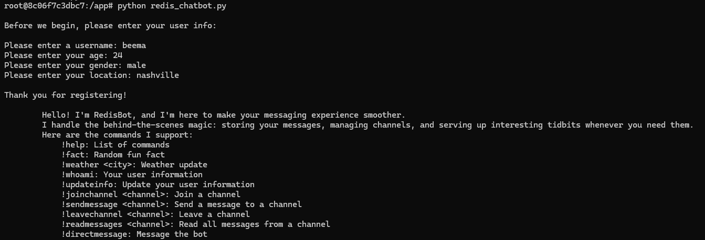
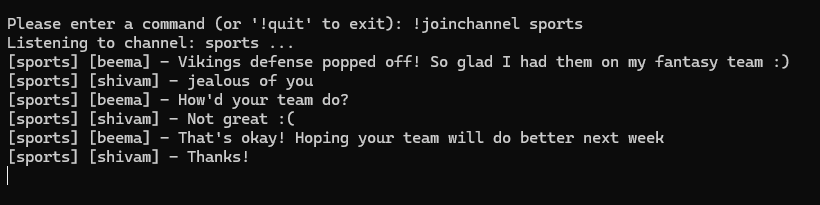
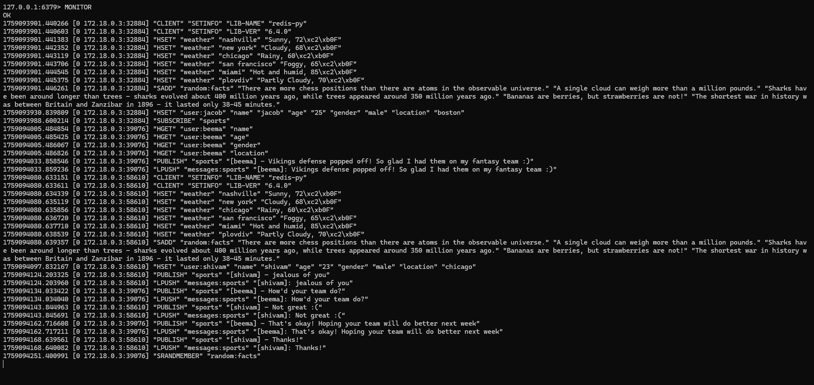

# Redis Pub/Sub Chatbot

A real-time messaging chatbot built with Redis Pub/Sub mechanism and Python, demonstrating NoSQL database integration and containerized application deployment.

## Quick Navigation
[Project Overview](#project-overview)  
[Features](#features)  
[Prerequisites](#prerequisites)  
[Setup & Installation](#setup--installation)  
[Usage Guide](#usage-guide)  
[Commands Reference](#commands-reference)  
[Development Process](#development-process)  
[Monitoring](#monitoring)  
[Demo Screenshots](#demo-screenshots)  
[Architecture](#architecture)  
[Known Issues](#known-issues)  
[Future Enhancements](#future-enhancements)  
[GenAI Disclosure](#genai-disclosure)  
[Contact](#contact)

## Project Overview

### Goal
Create a functional chatbot using Redis's Pub/Sub mechanism to demonstrate real-time messaging capabilities, Redis database integration, and Docker containerization skills. This project serves as a practical implementation of NoSQL concepts for modern data science applications.

### Purpose
- **Learning Objective**: Gain hands-on experience with Redis Pub/Sub messaging
- **Technical Skills**: Integration of Redis with Python, Docker containerization
- **Real-world Application**: Understanding of real-time messaging systems and NoSQL databases
- **Portfolio Development**: Showcase NoSQL and containerization skills for future opportunities

## Features

### Core Functionality
- **User Management**: User registration with persistent storage in Redis
- **Channel Operations**: Join/leave channels for organized conversations
- **Real-time Messaging**: Send and receive messages using Redis Pub/Sub
- **Message Persistence**: All messages are stored in Redis for retrieval
- **Interactive Commands**: Special bot commands for simple user experience

### Commands
- `!help` - Display all available commands
- `!weather <city>` - Get weather information for specified cities
- `!fact` - Receive random fun facts
- `!whoami` - Display your user information
- `!updateinfo` - Update your profile information

### Enhanced Features
- **Persistent Data Storage**: Weather data and fun facts stored in Redis
- **Message History**: Read previous messages from any channel
- **Direct Messaging**: Private communication with the bot
- **User-friendly Interface**: Clean, formatted output with clear instructions
- **Error Handling**: Informative error messages and input validation

## Prerequisites

### Required Software
- **Docker Desktop** - For containerization
- **Git** - For repository management

### System Requirements
- Operating System: Windows 10+, macOS 10.14+, or Linux
- RAM: Minimum 4GB (8GB recommended)
- Storage: 2GB free space for Docker images

## Setup & Installation

### 1. Clone the Repository
```bash
git clone https://github.com/BeemaRajan/redis_chatbot.git
cd redis-chatbot
```

### 2. Project Structure
```
redis-chatbot/
├── images                    # images for README
├── scripts/
│   └── redis_chatbot.py          # Main chatbot application
├── docker-compose.yml        # Docker services configuration
├── README.md                 # This file
├── LICENSE                   # Project license
└── .gitignore                # Git ignore rules
```

### 3. Start the Application
```bash
# Build and start all services
docker-compose up

# Or run in detached mode
docker-compose up -d
```

### 4. Access the Chatbot
```bash
# In a new terminal, connect to the Python container
docker-compose exec -it python-app bash

# Once inside container, run the script
python redis_chatbot.py
```

Note: Once you are done, remember to shut down the container using the following command:
```bash
# In a new terminal in the same file path as the docker-compose.yml file:
docker-compose down
```

## Usage Guide

### Initial Setup
1. **Start the Application**: Follow setup instructions above
2. **User Registration**: Upon first run, you'll be prompted to enter:
   - Username
   - Age
   - Gender
   - Location
3. **Begin Chatting**: Use commands or interact with channels

### Basic Workflow
1. **Register** your user information
2. **Join a channel** using `!joinchannel <channel_name>`
3. **Send messages** using `!sendmessage <channel_name>`
4. **Read message history** using `!readmessages <channel_name>`
5. **Use special commands** for weather, facts, and user info

## Commands Reference

### User Management
| Command | Description | Example |
|---------|-------------|---------|
| `!whoami` | Display your user information | `!whoami` |
| `!updateinfo` | Update your profile details | `!updateinfo` |

### Channel Operations
| Command | Description | Example |
|---------|-------------|---------|
| `!joinchannel <name>` | Subscribe to a channel | `!joinchannel general` |
| `!leavechannel <name>` | Unsubscribe from a channel | `!leavechannel general` |
| `!sendmessage <name>` | Send messages to a channel | `!sendmessage general` |
| `!readmessages <name>` | View channel message history | `!readmessages general` |

### Bot Features
| Command | Description | Example |
|---------|-------------|---------|
| `!help` | Show all available commands | `!help` |
| `!weather <city>` | Get weather for a city | `!weather nashville` |
| `!fact` | Get a random fun fact | `!fact` |
| `!directmessage` | Send a private message to bot | `!directmessage` |

### Available Cities for Weather
- Nashville
- New York
- Chicago
- San Francisco
- Miami
- Plovdiv

## Development Process

### Process

The development of this Redis chatbot followed a systematic approach with iterative refinement:

#### Phase 1: Core Feature Implementation
- **Foundation Setup**: Established basic Redis connection and Docker configuration
- **User Management**: Implemented user registration and data storage in Redis hash maps
- **Command Framework**: Built the command processing system with `process_commands()` function
- **Basic Pub/Sub**: Created channel subscription and message publishing functionality

#### Phase 2: Feature Enhancement & Data Integration
- **Redis Data Structures**: 
  - Integrated weather data storage using Redis hashes
  - Implemented fun facts storage using Redis sets with `SRANDMEMBER`
  - Added message persistence using Redis lists for channel history
- **Special Commands**: Developed bot commands (`!weather`, `!fact`, `!whoami`, `!help`)
- **User Experience**: Added formatted output, error handling, and input validation
- **Enhanced Features**: Implemented message saving, reading capabilities, and direct messaging

#### Phase 3: Iterative Testing & Refinement
- **Docker Integration**: Tested containerized deployment and resolved connection issues
- **Data Encoding**: Addressed byte/string encoding issues with Redis responses
- **Error Debugging**: Fixed infinite loops, command parsing errors, and decode failures
- **User Interface**: Refined command syntax and improved error messages for better usability

#### Phase 4: Documentation & Finalization
- **Code Documentation**: Added comprehensive comments explaining assignment requirement fulfillment
- **README Development**: Created detailed setup instructions and feature documentation
- **Testing Validation**: Verified all commands work correctly in containerized environment
- **Monitoring Setup**: Implemented Redis CLI monitoring for real-time interaction tracking

#### Development Methodology
This project followed an **incremental development approach** where each feature was implemented, tested, and refined before moving to the next component. The iterative cycle between feature implementation and testing ensured that issues were identified and resolved quickly, leading to a more robust final application.


### Design Decisions
1. **Redis Data Structures**:
   - **Hash Maps**: User information storage (`user:{username}`)
   - **Sets**: Fun facts storage for random selection (`random:facts`)
   - **Hash Maps**: Weather data by city (`weather`)
   - **Lists**: Message history per channel (`messages:{channel}`)

2. **Pub/Sub Implementation**:
   - Channels for topic-based messaging
   - Real-time message distribution
   - Persistent message storage for history

3. **User Experience**:
   - Clear command syntax
   - Informative error messages
   - Formatted output for readability

### Technical Implementation
- **Redis Integration**: Used `redis-py` library for Python-Redis communication
- **Data Persistence**: All user data, messages, and bot data stored in Redis
- **Containerization**: Docker Compose for multi-container orchestration
- **Error Handling**: Comprehensive input validation and error responses

## Monitoring

### Redis Monitoring with redis-cli
Monitor real-time Redis operations:

```bash
# Connect to Redis container
docker-compose exec -it redis redis-cli

# Monitor all Redis commands in real-time
> MONITOR
```

### Demo Screenshots
*Some demos of usage with the chatbot*

**Screenshot 1**: Initial setup and user registration


**Screenshot 2**: Channel messaging and bot commands  


**Screenshot 3**: Redis monitoring output


## Architecture

### System Components
```
┌─────────────────┐    ┌─────────────────┐
│   Python App    │    │   Redis Server  │
│  (slim-python)  │◄──►│   (my-redis)    │
└─────────────────┘    └─────────────────┘
         │                       │
         └───────────────────────┘
              Docker Network
               (app-network)
```

### Data Flow
1. User input → Python application
2. Commands processed → Redis operations
3. Pub/Sub messages → Redis channels
4. Data retrieval → Redis queries
5. Formatted output → User interface

## Known Issues

### Current Limitations
- **Channel Listening**: Infinite loop in `join_channel()` function requires manual exit
- **Bot Chat**: Limited response in '!directmessage'

### Workarounds
- Use `!readmessages` instead of live channel listening
- Exit Docker container if stuck in listening mode

## Future Enhancements

### Potential Improvements
- **Interactive Direct Messaging**: Utilize lightweight transformer for interactive messaging
- **Threading**: Implement non-blocking channel listening
- **User Authentication**: Add password protection
- **Channel Management**: Private channels and moderator controls
- **Message Encryption**: Secure message transmission
- **Web Interface**: Browser-based chat interface

### Extra Credit Features Implemented
- **Clean Output Formatting**: Structured and readable message display
- **Enhanced Commands**: Additional bot functionality beyond requirements
- **Data Persistence**: Comprehensive Redis integration for all features
- **User Experience**: Intuitive command structure and error handling

## GenAI Disclosure

### Use of Generative AI

This project utilized Generative AI for the following purposes:

#### AI-Assisted Development (≈20% of total work):
- **Code Structure Guidance**: Assistance with Redis Python integration patterns
- **Docker Configuration**: Help with docker-compose.yml setup and debugging
- **Error Resolution**: Debugging assistance for Redis connection and decoding issues
- **README Creation**: Creating and formatting comprehensive README

#### Original Student Work (≈80% of total work):
- **Core Logic Implementation**: All chatbot functionality and command processing
- **Redis Data Design**: Database schema and data structure decisions
- **Feature Planning**: Command set design and user experience flow
- **Testing and Refinement**: Manual testing, bug identification, and feature validation

The AI assistant provided guidance and suggestions, but all final implementation decisions, code writing, and feature development were performed by the student. This collaboration enhanced learning by providing real-time feedback and debugging support while maintaining student ownership of the project.

## Contact

**Project Developer**: [Beema Rajan]  
**Email**: [code.beema@gmail.com]  
**Date**: [2025-09-28]

---

*This project demonstrates practical application of Redis Pub/Sub messaging, Docker containerization, and NoSQL database integration for real-time communication systems.*